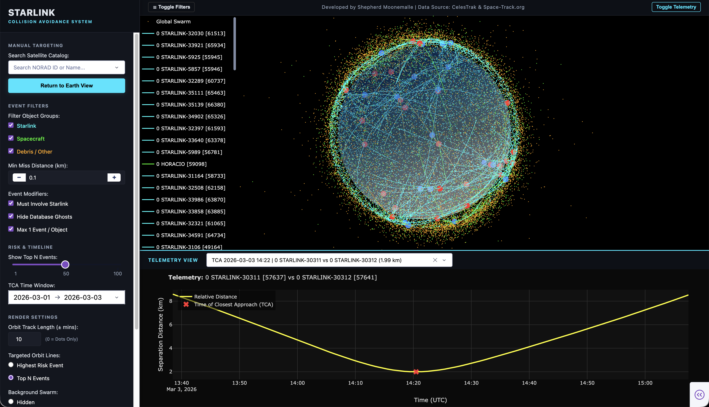

# Starlink Collision Avoidance System

A fully automated Space Operations Center (SOC) pipeline that monitors the Starlink satellite constellation for potential conjunctions (close approaches) with other resident space objects. The system ingests live Two-Line Element (TLE) data from Space-Track.org, propagates orbits using SGP4, detects close-approach candidate pairs via a KD-Tree spatial index, computes Time of Closest Approach (TCA) and miss-distance metrics, scores events by risk, validates results against the SOCRATES reference catalog, and presents everything in an interactive 3D Dash/Plotly dashboard.

> **Note:** This project was co-developed with my brother. You can view his GitHub profile [here](https://github.com/mooneedg/Starlink_Project).
---

## Project Motivation: The Crowded LEO Environment

Recent incidents involving mega-constellations highlight the severe and growing risk of orbital collisions. With reports of damaged Starlink satellites tumbling after partial breakups and near-misses with other spacecraft, Low Earth Orbit (LEO) has become an incredibly dense and hazardous environment.

With thousands of active satellites and an exponentially increasing volume of debris, even minor positional deviations can result in dangerous conjunctions. A single hypervelocity impact could generate thousands of shrapnel fragments, potentially triggering a cascading **Kessler effect** that threatens critical global space infrastructure.

**The Goal:** This project was developed to explore how automated systems can preemptively detect and analyze these close approaches. By ingesting raw orbital data, propagating trajectories, spatially filtering encounters, and calculating the exact Time of Closest Approach (TCA), this system provides early, actionable insight into high-risk events. The ultimate goal is to demonstrate how scalable data pipelines and orbital mechanics models can support collision avoidance and improve **Space Domain Awareness (SDA)**.

---

## Dashboard Preview



---

## Features

- **End-to-end automation** — a single command runs ingestion → propagation → spatial filtering → conjunction analysis → validation → report generation
- **24-hour scheduler** — the pipeline re-runs itself every 24 hours without human intervention
- **SGP4 / Skyfield orbit propagation** — 48-hour look-ahead window at 60-second resolution
- **KD-Tree spatial filter** — eliminates non-threatening pairs before expensive TCA math
- **Vectorized TCA solver** — NumPy-based Time of Closest Approach and miss-distance computation for thousands of candidate pairs
- **Risk scoring** — deterministic inverse-distance risk score for every conjunction event
- **SOCRATES validation** — cross-references computed events against the ESA/CelesTrak SOCRATES catalog to measure precision and recall
- **Interactive 3D dashboard** — real-time Dash/Plotly app with an animated 3D Earth globe, orbit trails, conjunction markers, and a telemetry panel
- **Automated HTML reports** — Jinja2-rendered daily report with top-10 risk events, charts, and pipeline health metadata
- **Health checks** — post-run verification of TLE freshness, propagation output size, conjunction event count, and validation accuracy
- **SQLite database** — lightweight persistence layer for space objects, TLEs, and object group classifications

---

## Architecture

The pipeline is organised into six sequential phases:

```
┌─────────────────────────────────────────────────────────────────────┐
│  Phase 1 │  Database Initialisation  (database/init_db.py)          │
│          │  Creates space_objects, tles, object_groups tables       │
├─────────────────────────────────────────────────────────────────────┤
│  Phase 2 │  TLE Ingestion  (ingestion/ingest_spacetrack.py)         │
│          │  Downloads latest TLEs from Space-Track.org via REST API │
├─────────────────────────────────────────────────────────────────────┤
│  Phase 3 │  Orbit Propagation  (propagation/propagator.py)          │
│          │  SGP4 via Skyfield → lat/lon/alt at 60-second intervals  │
│          │  Output: data/processed/orbit_data.parquet               │
├─────────────────────────────────────────────────────────────────────┤
│  Phase 4a│  Spatial Indexing  (spatial_index/candidate_pairs.py)    │
│          │  cKDTree radius query → filters candidate close pairs    │
│          │  Output: data/processed/candidate_pairs.parquet          │
├─────────────────────────────────────────────────────────────────────┤
│  Phase 4b│  Conjunction Analysis  (conjunction/conjunction_analyzer)│
│          │  Vectorized TCA + miss-distance + risk score             │
│          │  Output: data/processed/conjunction_events.parquet       │
├─────────────────────────────────────────────────────────────────────┤
│  Phase 5 │  SOCRATES Validation  (validation/run_validation.py)     │
│          │  Matches events vs. SOCRATES; computes precision/recall  │
│          │  Output: data/processed/validation_metrics.json          │
└─────────────────────────────────────────────────────────────────────┘
            ↓
    Daily HTML Report  (reporting/report_generator.py)
    Interactive Dashboard  (visualization/app.py)
```

---

## Prerequisites

| Requirement | Version |
|---|---|
| Python | 3.10+ |
| [Space-Track.org](https://www.space-track.org) account | Free registration |

---

## Installation

```bash
# 1. Clone the repository
git clone https://github.com/sxm209/Starlink-Project.git
cd Starlink-Project

# 2. Create and activate a virtual environment
python -m venv venv
source venv/bin/activate        # macOS / Linux
# venv\Scripts\activate         # Windows

# 3. Install dependencies
pip install -r requirements.txt
```

---

## Configuration

The ingestion module authenticates with Space-Track.org using credentials stored in a `.env` file in the project root.

In the project root directory, create a new file named exactly **.env**.
`.env`:
```
SPACETRACK_USERNAME=your_email@example.com
SPACETRACK_PASSWORD=your_password
```

> **Never commit `.env` to version control.** It is listed in `.gitignore` and your credentials will not be pushed to GitHub.

---

## Usage

### Run the full pipeline once

```bash
python -m pipeline.run_pipeline
```

This executes all six phases in order, runs health checks, and generates a dated HTML report in `reports/`.

### Run on a 24-hour schedule

```bash
python -m pipeline.scheduler
```

The scheduler blocks the terminal and re-runs the full pipeline every 24 hours.

### Launch the interactive dashboard

> The dashboard requires that Phase 3 (propagation) and Phase 4b (conjunction analysis) have completed successfully so the Parquet files exist.

```bash
python visualization/app.py
```

Then open [http://127.0.0.1:8050](http://127.0.0.1:8050) in your browser.

### Run individual phases

Each module can be executed in isolation for development or debugging:

```bash
python database/init_db.py                       # Phase 1 – initialise DB
python -m ingestion.ingest_spacetrack            # Phase 2 – ingest TLEs
python -m propagation.propagator                 # Phase 3 – propagate orbits
python -m spatial_index.candidate_pairs          # Phase 4a – build KD-Tree
python -m conjunction.conjunction_analyzer       # Phase 4b – compute TCAs
python -m validation.run_validation              # Phase 5 – SOCRATES check
```

### SOCRATES Validation

Download the latest SOCRATES conjunction report (CSV format) from [CelesTrak SOCRATES](https://celestrak.org/SOCRATES/socrates-format.php) and place it at:

```
data/external/sort-minRange.csv
```

The validation phase is **non-critical** — the pipeline continues even if this file is absent.

---

## Project Structure

```
starlink-collision-avoidance/
├── conjunction/
│   ├── closest_approach.py      # Vectorized TCA and miss-distance solver
│   ├── conjunction_analyzer.py  # Main conjunction analysis orchestrator
│   └── risk_score.py            # Inverse-distance risk scoring
├── data/
│   ├── external/                # Third-party reference data (SOCRATES CSV)
│   ├── processed/               # Generated Parquet files and metrics JSON
│   └── raw/spacetrack/          # Downloaded TLE text files (auto-generated)
├── database/
│   └── init_db.py               # SQLAlchemy schema: space_objects, tles, groups
├── ingestion/
│   ├── ingest_spacetrack.py     # Space-Track.org REST API ingestion
│   └── update_db_groups.py      # Satellite catalog group classification
├── pipeline/
│   ├── health_checks.py         # Post-run data quality verification
│   ├── run_pipeline.py          # Orchestrates all phases end-to-end
│   └── scheduler.py             # 24-hour automated run loop
├── propagation/
│   ├── coordinate_utils.py      # Geodetic coordinate validation helpers
│   ├── propagator.py            # SGP4 propagation via Skyfield
│   └── time_grid.py             # Uniform time-step grid generator
├── reporting/
│   ├── report_generator.py      # Jinja2 HTML report builder
│   └── templates/
│       └── daily_report.html    # Report template
├── spatial_index/
│   ├── candidate_pairs.py       # KD-Tree candidate pair generation
│   └── kd_tree.py               # SciPy cKDTree wrapper
├── utils/
│   └── spacetrack_client.py     # Authenticated HTTP client for Space-Track.org
├── validation/
│   ├── ingest_socrates.py       # SOCRATES CSV parser
│   ├── matcher.py               # Internal ↔ SOCRATES event matcher
│   ├── metrics.py               # Precision / recall computation
│   └── run_validation.py        # Validation phase orchestrator
├── visualization/
│   ├── app.py                   # Dash application entry point
│   ├── conjunction_markers.py   # Conjunction event 3D markers
│   ├── earth.py                 # 3D Earth mesh generation
│   ├── layout.py                # Dash UI layout
│   ├── orbits.py                # Orbit trail rendering
│   ├── telemetry.py             # Telemetry panel figures
│   └── assets/style.css         # Custom CSS
├── logs/                        # Auto-generated daily pipeline logs
├── reports/                     # Auto-generated HTML daily reports
├── .env                         # Credentials (not committed see .gitignore)
├── .gitignore
├── LICENSE
├── README.md
└── requirements.txt
```

---

## Technical Parameters

These are the exact values hard-coded in the pipeline. Change them in the files listed to tune the system.

### Orbit Propagation (`propagation/propagator.py`)

| Parameter | Value | Description |
|---|---|---|
| Look-ahead window | **48 hours** | How far ahead each pipeline run simulates |
| Time step | **60 seconds** | Interval between computed position snapshots |

### Object Eligibility (`propagation/coordinate_utils.py`)

Before any conjunction analysis, every propagated orbit is checked against physical-realism bounds. Objects that fail either check are silently excluded from all downstream phases.

| Rule | Threshold | What it filters out |
|---|---|---|
| Minimum altitude | **> 100 km** above Earth's surface | Re-entering debris and decayed satellites whose SGP4 orbit has already dipped into the atmosphere |
| Maximum radius | **< 100,000 km** from Earth's center | Deep-space objects (e.g. lunar or interplanetary) that are far outside the LEO/MEO region of interest |

> Starlink operates at roughly **540–570 km** altitude, well inside the valid band.

### Conjunction Screening KD-Tree Search Radius (`spatial_index/candidate_pairs.py`)

| Parameter | Value | Imperial equivalent |
|---|---|---|
| `SEARCH_RADIUS_KM` | **2.0 km** | ≈ 1.24 miles |

At every 60-second time step, a KD-Tree is built from all active object positions. Any two objects within **2.0 km (≈ 1.24 miles)** of each other at *any* point in the 48-hour window are flagged as a candidate pair and passed to the TCA solver. Pairs further apart are discarded without further calculation.

### Time of Closest Approach Filter (`conjunction/conjunction_analyzer.py`)

After the vectorized TCA is solved for each candidate pair, a second filter is applied:

| Rule | Value | Reason |
|---|---|---|
| `tca_seconds >= 0` | Must be in the future | Eliminates pairs whose closest approach has already passed relative to the snapshot time |
| `tca_seconds <= 3600` | Within **1 hour** of snapshot | Prevents false positives from linear extrapolation over long durations |

### Risk Score (`conjunction/risk_score.py`)

Each surviving event is assigned a risk score using an inverse-distance formula:

$$\text{Risk Score} = \frac{1}{\text{Miss Distance (km)} + \varepsilon}$$

where $\varepsilon = 0.001$ prevents division by zero for a theoretical direct collision. A smaller miss distance produces a higher score there is no upper cap.

### Object Classification (`ingestion/update_db_groups.py`)

Every tracked object is assigned one of three group labels sourced from the official DoD SATCAT via CelesTrak:

| Label | Criteria |
|---|---|
| **Starlink** | Object name contains `STARLINK` |
| **Spacecraft** | Object type code is `PAY` (payload) and not Starlink |
| **Debris/Other** | Everything else rocket bodies, fragmentation debris, unknown objects |

All three groups are included in propagation and conjunction analysis. The group label is used only for display colouring and filtering in the dashboard.

### SOCRATES Validation Tolerances (`validation/matcher.py`)

When cross-referencing computed events against the SOCRATES reference catalog, a predicted event is counted as a **true positive** only if it satisfies both:

| Tolerance | Value |
|---|---|
| Time of Closest Approach | Within **±300 seconds** (5 minutes) |
| Miss distance | Within **±0.5 km** |

### TLE Recency

The Space-Track query filters for TLEs with an epoch within the last **30 days** (`epoch />now-30`). Older TLEs are not downloaded and will not appear in the database.

---

## Key Dependencies

| Library | Purpose |
|---|---|
| [Skyfield](https://rhodesmill.org/skyfield/) | SGP4 orbit propagation and time-scale handling |
| [sgp4](https://pypi.org/project/sgp4/) | SGP4/SDP4 satellite propagation model |
| [SciPy](https://scipy.org/) | `cKDTree` spatial indexing |
| [NumPy](https://numpy.org/) | Vectorized TCA solver and coordinate maths |
| [Pandas](https://pandas.pydata.org/) | Tabular data processing and Parquet I/O |
| [Dash / Plotly](https://dash.plotly.com/) | Interactive 3D web dashboard |
| [SQLAlchemy](https://www.sqlalchemy.org/) | ORM and SQLite database layer |
| [Jinja2](https://jinja.palletsprojects.com/) | HTML report templating |
| [python-dotenv](https://pypi.org/project/python-dotenv/) | `.env` credential loading |
| [requests](https://requests.readthedocs.io/) | Space-Track.org HTTP calls |

---

## Generated Output Files

| File | Description |
|---|---|
| `database/SpaceData.db` | SQLite database (space objects, TLEs, groups) |
| `data/processed/orbit_data.parquet` | Propagated orbit positions (lat/lon/alt) |
| `data/processed/candidate_pairs.parquet` | Spatially filtered close-approach candidate pairs |
| `data/processed/conjunction_events.parquet` | Final conjunction events with TCA, miss-distance, and risk score |
| `data/processed/validation_metrics.json` | Precision, recall, and error metrics vs. SOCRATES |
| `reports/daily_report_<YYYYMMDD>.html` | Self-contained HTML daily report |
| `logs/pipeline_<YYYYMMDD>.log` | Timestamped pipeline execution log |

---

## Future Plans & Roadmap

While the current pipeline successfully identifies deterministic close approaches, space operations are inherently probabilistic. Future iterations of this project will focus on:

- **Probability of Collision (Pc):** Transitioning from scalar miss distances to 3D covariance matrix intersections to calculate realistic collision probabilities.

- **Maneuver Optimization:** Implementing a Machine Learning / Control Theory module to suggest optimal Delta-v burns for evasive maneuvers.

- **Distributed Cloud Architecture:** Containerizing the physics engine with Docker and utilizing Apache Spark or Ray to horizontally scale propagation across parallel compute nodes.

---

## References & Context

- "Stargaze: SpaceX's Space Situational Awareness System." *Starlink Updates*, SpaceX. [Link](https://starlink.com/pl/updates/stargaze?srsltid=AfmBOoogdEhaSzAXXL5JGr_WcFnvzpSqWe1_bmHkciaeilPjY8_5n5bt)
  
- Wall, Mike. "A SpaceX Starlink Satellite Is Tumbling and Falling Out of Space After Partial Breakup in Orbit." *Space.com*, 18 Dec. 2025. [Link](https://www.space.com/spacex-starlink-satellite-tumbling-falling-orbit-partial-breakup)

- "Elon Musk's Starlink Satellite Crashes: Here's What Happened." *MSN*. [Link](https://www.msn.com/en-us/news/technology/elon-musk-s-starlink-satellite-crashes-here-s-what-happened)

- Wall, Mike. "Spacecraft From Chinese Launch Nearly Slammed Into Starlink Satellite, SpaceX Says." *Space.com*. [Link](https://www.space.com/spacex-starlink-chinese-rocket-near-miss)

- [Space-Track.org](https://www.space-track.org) — Official source for TLE data (U.S. Space Force 18th Space Control Squadron)

- [CelesTrak SOCRATES](https://celestrak.org/SOCRATES/) — Satellite Orbital Conjunction Reports Assessing Threatening Encounters in Space

---

## License

This project is licensed under the **MIT License** — see [LICENSE](LICENSE) for details.
